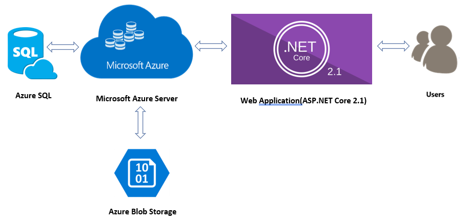
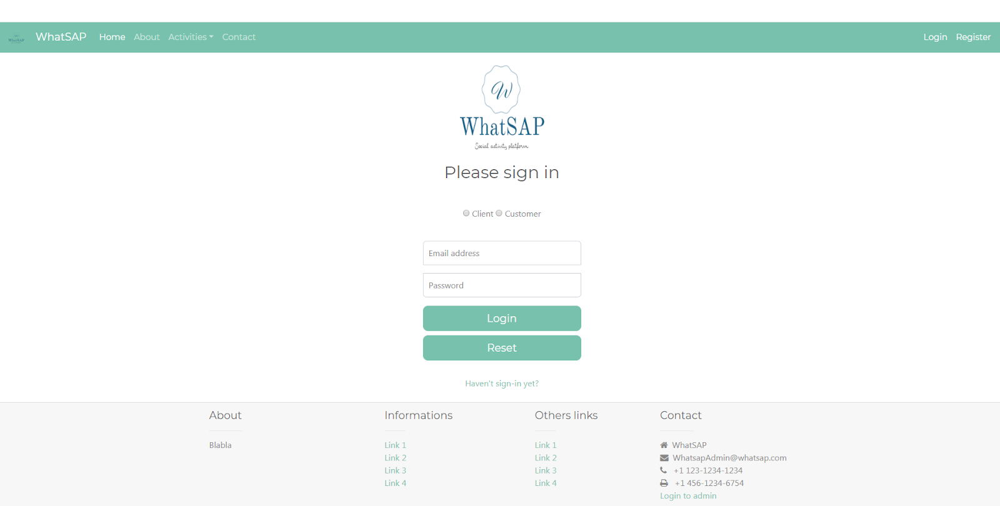
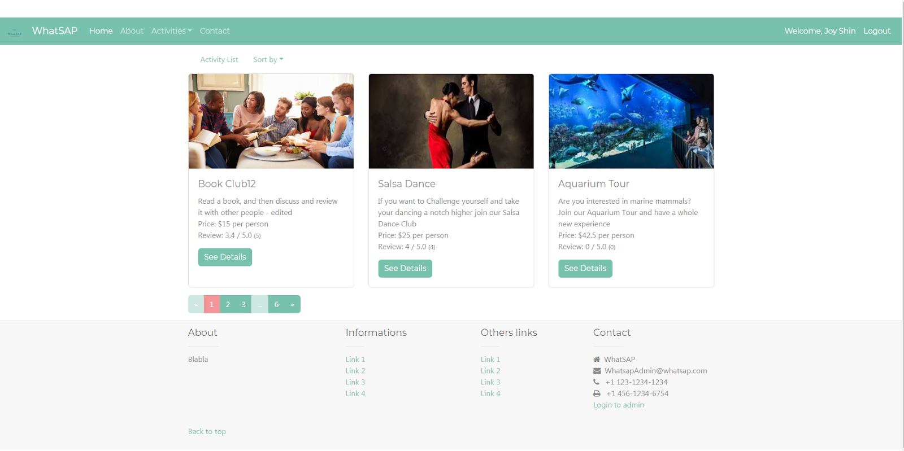
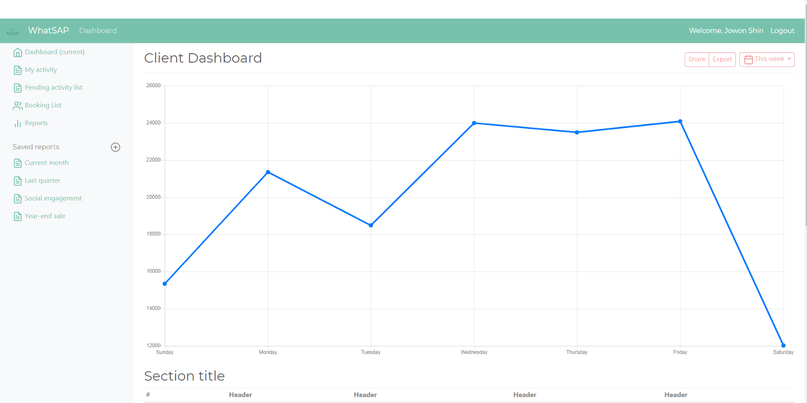

# WhatSAP

### 1. Logo

Social Activity Platform Website
### 2. URL
http://whatsap-team05.azurewebsites.net/(Suspended)

### 3. Objective
#### The objective of WhatSAP project is to develop the effect social web platform that matching useful information between the customer and the client. It facilitates the customer to find indoor/outdoor activities. At the same time, the client provides/promotes their services (activity programs) through the web. 

### 4. System Architecture

### 5. Screenshots

